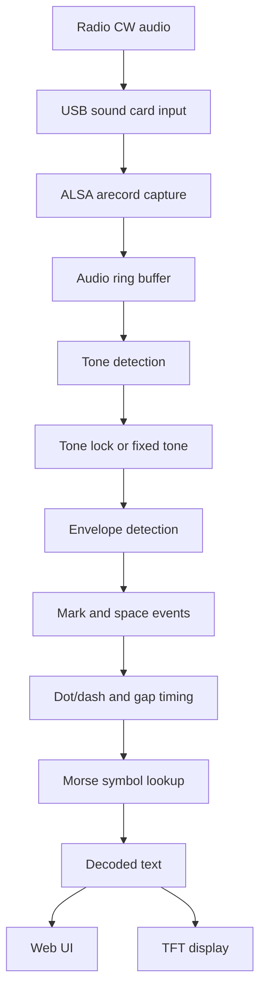
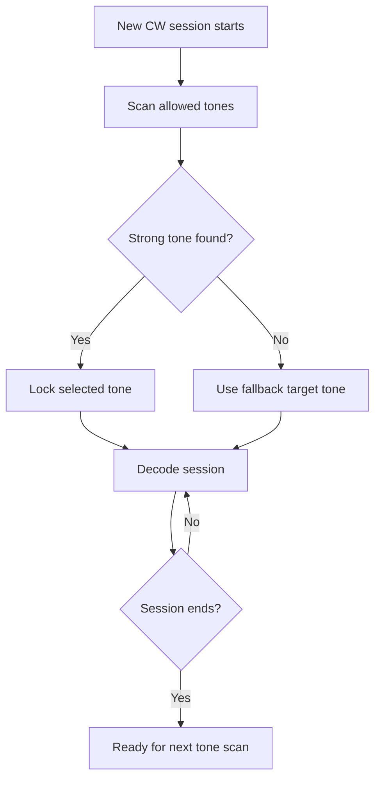
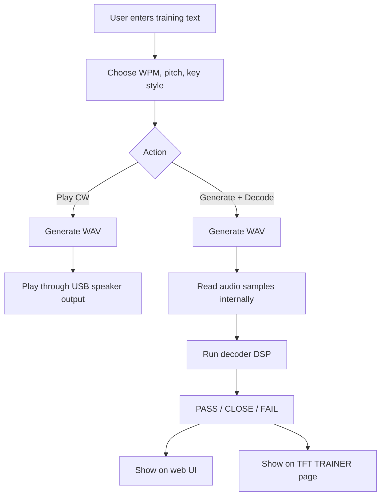
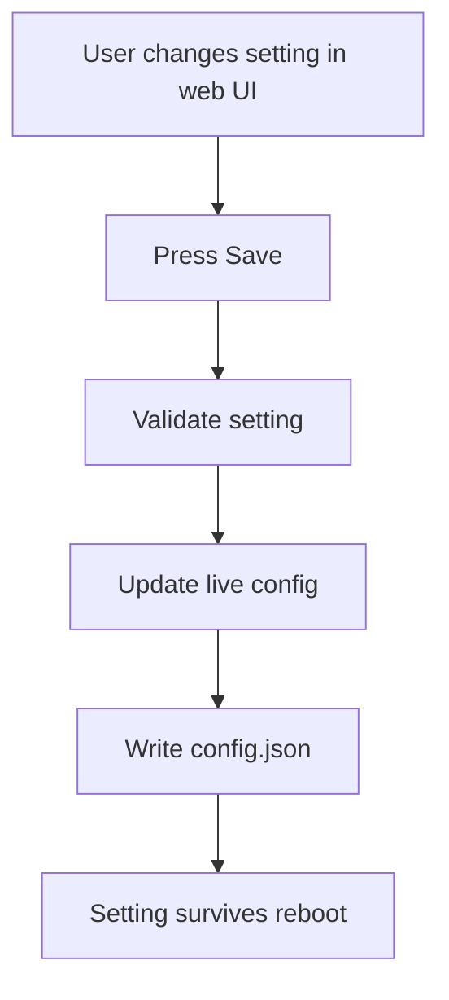

# The Morse Whisperer rPi Edition — User Manual

> A plain-English guide for using, understanding, and maintaining **The Morse Whisperer** Morse/CW decoder appliance.

---

## 1. What is The Morse Whisperer?

**The Morse Whisperer** is a Raspberry Pi-based Morse code decoder and trainer.

It listens to Morse/CW audio through a USB sound card, detects the tone, works out the dots and dashes, and displays decoded text on:

- the small TFT screen on the device
- the built-in web interface
- the JSON API for diagnostics and future integrations

It also includes a **CW Generator / Trainer**, which can create Morse practice audio and run a built-in self-test where generated Morse is decoded internally by the same decoder engine.

---

## 2. Quick Start

### 2.1 Turn it on

1. Plug in power to the Raspberry Pi.
2. Wait for the splash screen and boot process.
3. The TFT screen should show the Morse Whisperer display.
4. The decoder service starts automatically.

If the screen is blank, wait 20–30 seconds first. If it is still blank, power-cycle only after giving the Pi time to finish booting.

### 2.2 Connect audio

The decoder expects audio through a USB sound card or USB audio device.

```text
Radio speaker / headphone / line out
        ↓
USB sound card input
        ↓
Raspberry Pi
        ↓
The Morse Whisperer decoder
```

For best results, start with low radio volume and increase until the web UI shows **Audio GOOD**. Avoid clipping and noisy audio where possible.

### 2.3 Open the web interface

From a computer, phone, or tablet on the same network, open:

```text
http://<Pi-IP-address>:8080
```

Example:

```text
http://192.168.101.22:8080
```

If you do not know the Pi IP address, check your router/DHCP leases or run this on the Pi:

```bash
hostname -I
```

---

## 3. Web Interface Overview

The web interface is the main control panel. It shows decoded text, raw copy, selected tone, audio level, SNR, confidence, tone ranking, settings, trainer controls, and self-test results.

### 3.1 Main decoded copy

The large text area shows the accepted decoded copy. If there is no current copy, it will show:

```text
Waiting for CW…
```

### 3.2 Raw copy

The raw copy area shows decoded characters before light formatting. This helps separate audio/timing issues from display/formatting issues.

### 3.3 Current Signal

| Field | Meaning |
|---|---|
| Selected tone | The tone the decoder is currently using |
| Fallback target | The default tone used if auto tone cannot lock |
| WPM estimate | Estimated Morse speed |
| Reason | Current decode status |
| Session | Live decode session status |
| Buffer | Audio buffer status |

### 3.4 Audio quality

| Status | Meaning |
|---|---|
| IDLE | No useful audio |
| LOW | Audio is too quiet or marginal |
| GOOD | Good operating range |
| HOT | Audio is too loud |
| CLIP | Audio is clipping and likely distorted |

Aim for:

```text
Audio: GOOD
Clip: 0%
```

### 3.5 Tone ranking

Tone ranking shows which Morse audio tones are strongest. It is useful when the decoder chooses the wrong tone, when there is noise, or when testing auto tone mode.

---

## 4. TFT Screen Navigation

The TFT screen is for quick local use. Pages cycle like this:

```text
COPY → STATUS → RAW → SETTINGS → TRAINER
```

### COPY page

Shows current accepted decoded text.

### STATUS page

Shows tone, SNR, confidence, audio level, and current mode.

### RAW page

Shows raw decoded text.

### SETTINGS page

Shows key settings such as decoder mode, tone, WPM hint, input level, TFT brightness, output device, and generator settings.

### TRAINER page

Shows the most recent CW Generator / Trainer self-test result: PASS, CLOSE, or FAIL, plus expected text, decoded text, tone, WPM, SNR, and confidence.

---

## 5. Decoder Modes

### Full auto — recommended

This is the default mode. It scans for the CW tone at the start of a session, then locks onto it. This is best for normal live-radio use.

Internal value:

```text
session_auto
```

### Continuous auto tone

The decoder keeps following the strongest tone live. Useful for testing, but it can jump around if noise or harmonics become stronger than the actual CW tone.

Internal value:

```text
auto
```

### Manual fixed tone

The decoder uses the tone you set manually. Best for learning, controlled tests, and training.

Internal value:

```text
fixed
```

---

## 6. Basic How-To Tasks

### 6.1 Decode Morse from a radio

1. Turn on the Pi.
2. Connect radio audio to the USB sound card input.
3. Open the web interface.
4. Set decoder mode to **Full auto — recommended**.
5. Tune the radio to a CW signal.
6. Adjust volume or input level until audio shows **GOOD**.
7. Watch decoded copy on the web UI or TFT COPY page.

### 6.2 Use manual mode for learning

1. Open the web UI.
2. Go to **Settings**.
3. Set decoder mode to **Manual fixed tone**.
4. Enter the tone, for example `700 Hz`.
5. Set a WPM hint, for example `18.75`.
6. Save settings.

### 6.3 Change input level

1. Open the web UI.
2. Go to **Settings**.
3. Adjust **Input level %**.
4. Press **Save settings**.

The Pi attempts to set ALSA capture level. If the USB sound card does not expose a normal capture control, the value may still save but not physically change gain. In that case, use the radio volume control.

### 6.4 Change TFT brightness

The TFT brightness control uses **software dimming**. It darkens the image drawn to the screen but does not physically dim the LCD backlight.

The current screen does not expose a normal Linux hardware backlight device, so this is the safe approach.

### 6.5 Reset to defaults

Use **Reset to defaults** from the web UI. Settings are saved to:

```text
/opt/morse-whisperer-pi/config.json
```

---

## 7. CW Generator / Trainer

The CW Generator / Trainer creates Morse code from text.

It can:

- play Morse audio through the USB sound card output
- generate Morse internally
- run a decoder self-test
- simulate different keying styles

### 7.1 Trainer controls

| Control | Meaning |
|---|---|
| Training text | Text to turn into Morse |
| Character speed WPM | Speed of individual Morse characters |
| Farnsworth / overall WPM | Overall speed with stretched gaps if lower |
| Simulated Morse key | Timing style |
| Pitch Hz | Audio tone |
| Volume % | Output volume |
| Start-up delay | Silence before sending |
| End gap | Silence after sending |

### 7.2 Key styles

| Style | Meaning |
|---|---|
| Computer — perfect timing | Clean generated Morse. Best for testing |
| Paddle — clean | Slightly human but tidy |
| Paddle — learner | More timing variation |
| Bug — light humanise | Semi-automatic bug feel |
| Straight key — humanise | More hand-sent variation |

Use **Computer — perfect timing** when testing the decoder.

### 7.3 Play CW

Press **Play CW** to send generated Morse to the USB audio output.

### 7.4 Stop CW

Press **Stop CW** to stop audio playback.

### 7.5 Generate + Decode

This is the built-in self-test.

```text
Text
  ↓
CW Generator
  ↓
Generated audio samples
  ↓
Decoder DSP
  ↓
Decoded text
  ↓
PASS / CLOSE / FAIL
```

It does not use the speaker or microphone. It runs faster than real time because it analyses generated audio directly in memory.

---

## 8. Understanding Self-Test Results

| Status | Meaning |
|---|---|
| PASS | Decoded text matches expected text |
| CLOSE | Decode is similar but not exact |
| FAIL | Decode does not match |

If self-test passes but live radio decode is poor, the issue is probably the physical audio path, radio level, clipping, tone lock, or noise.

If self-test fails, the issue is probably generator timing, DSP timing, decoder logic, or settings.

---

## 9. Flow Charts

### 9.1 Normal live decoding flow



### 9.2 Full auto tone flow



### 9.3 CW Generator / Trainer flow



### 9.4 Settings persistence flow



---

## 10. How It Works — More Detailed

### 10.1 Audio capture

The Pi captures audio using ALSA, usually through `arecord`.

Typical capture settings:

```text
Sample rate: 8000 Hz
Format: 16-bit signed PCM
Channels: mono
```

The audio stream is placed into an internal ring buffer.

### 10.2 Tone detection

The decoder checks likely CW audio tones such as:

```text
400, 500, 550, 600, 650, 700, 750, 800, 850, 900, 950, 1000 Hz
```

It measures how much signal energy exists at each tone. The strongest suitable tone is used.

### 10.3 Session tone locking

In full auto mode, the decoder scans at the start of a session, finds a likely CW tone, locks it, and decodes the session using that tone. This avoids tone jumping during noise.

### 10.4 Envelope detection

Once a tone is selected, the decoder follows the strength of that tone over time. Strong tone energy becomes a **mark**. Low tone energy becomes a **space**.

### 10.5 Mark and space timing

Morse timing relationships:

```text
dit              = 1 unit
dah              = 3 units
gap inside char  = 1 unit
gap between char = 3 units
gap between word = 7 units
```

The decoder estimates dot length and classifies marks and spaces.

### 10.6 Morse lookup

Dots and dashes are matched against a Morse lookup table.

Example:

```text
- .... .
```

becomes:

```text
THE
```

### 10.7 Confidence and SNR

| Value | Meaning |
|---|---|
| SNR | Signal-to-noise ratio |
| Confidence | How believable the timing and decode are |
| Reason | Why the decoder accepted or rejected a decode |

---

## 11. Software Technologies Used

### Python

Main application language.

Used for audio handling, DSP, web server, TFT display, configuration, CW generator, and self-test.

### Flask

Provides the web interface and API endpoints such as:

```text
/api/snapshot
/api/settings
/api/cw/play
/api/cw/stop
/api/cw/selftest
```

### NumPy

Used for fast audio sample and DSP calculations.

### ALSA

Linux audio system used for input and output through tools such as:

```text
arecord
aplay
amixer
```

### Framebuffer TFT output

The TFT display is drawn through Linux framebuffer devices. The current TFT appears as:

```text
/dev/fb1
fb_ili9340
320x240
16-bit colour
```

### Pillow

Used to draw the TFT interface as an image before writing it to the framebuffer.

### DSP algorithms

The decoder uses:

- tone power detection
- windowed frame analysis
- envelope smoothing
- Schmitt trigger style mark/space detection
- dot length estimation
- mark/space timing classification
- Morse symbol lookup

---

## 12. Useful API Endpoints

| Endpoint | Purpose |
|---|---|
| `GET /api/snapshot` | Current decoder state |
| `GET /api/settings` | Current settings |
| `POST /api/settings` | Save settings |
| `POST /api/settings/defaults` | Reset defaults |
| `POST /api/cw/play` | Play generated CW |
| `POST /api/cw/stop` | Stop generated CW |
| `POST /api/cw/selftest` | Generate CW and decode internally |
| `/download/copy.txt` | Download decoded copy |
| `/download/report.json` | Download diagnostics report |

---

## 13. Troubleshooting

### No web interface

```bash
sudo systemctl status morse-whisperer --no-pager -l
hostname -I
```

Then open:

```text
http://<Pi-IP>:8080
```

### Web interface works but no decode

Check:

- radio audio is connected
- audio level is not LOW or CLIP
- decoder mode is Full auto or correct manual tone
- the signal is actually CW
- squelch is opening

### Audio is LOW

Try:

- increasing radio volume
- increasing capture level
- checking USB sound card input
- using headphone/line output instead of a weak speaker pickup

### Audio is CLIP or HOT

Try:

- lowering radio volume
- lowering capture level
- avoiding direct high-level speaker output into mic input without attenuation

### Self-test passes but live decode is poor

The decoder logic can decode clean generated Morse. Look at the physical input path: cable, clipping, low level, noise, wrong tone, RF fading, or hum.

### TFT brightness does not change the backlight

Expected. The screen does not expose hardware backlight control. Brightness is software dimming.

---

## 14. Good Default Settings

| Setting | Value |
|---|---|
| Decoder mode | Full auto — recommended |
| Target tone | 700 Hz |
| WPM hint | 18.75 |
| Word gap units | 6.0 |
| Adaptive word gap | Off |
| Audio input level | 70% |
| TFT brightness | 80% |
| CW generator tone | 700 Hz |
| CW generator WPM | 18.75 |
| CW generator key profile | Computer |

---

## 15. Plain-English Glossary

| Term | Meaning |
|---|---|
| CW | Continuous Wave, commonly used for Morse |
| Morse code | Dots and dashes representing letters and numbers |
| Dit | A short Morse mark |
| Dah | A long Morse mark |
| WPM | Words per minute |
| Farnsworth timing | Faster characters with larger gaps for learning |
| Tone | Audio pitch of the Morse signal |
| SNR | Signal-to-noise ratio |
| Confidence | Decoder trust estimate |
| Framebuffer | Linux display output device |
| DSP | Digital Signal Processing |

---

## 16. Maintenance Notes

Restart service:

```bash
sudo systemctl restart morse-whisperer
```

Check logs:

```bash
sudo journalctl -u morse-whisperer -n 120 --no-pager
```

Check config:

```bash
cat /opt/morse-whisperer-pi/config.json
```

Back up config:

```bash
cp /opt/morse-whisperer-pi/config.json ~/morse-whisperer-config-backup.json
```

---

## 17. Recommended Learning Workflow

1. Start with the trainer in **Computer** mode.
2. Use 700 Hz and 18.75 WPM.
3. Press **Generate + Decode** and confirm PASS.
4. Press **Play CW** and listen.
5. Try decoding the same audio live through the input path.
6. Move to slower/faster WPM.
7. Try humanised key profiles.
8. Try real radio audio.

---

## 18. Final Notes

The Morse Whisperer is both a decoder and a learning tool.

The best way to use it is:

- keep audio clean
- start with full auto mode
- use the trainer to test known-good Morse
- use self-test to separate software problems from audio path problems
- adjust one setting at a time

If the decoder starts acting haunted, run the self-test first. If self-test passes, the ghost is probably in the audio chain.
